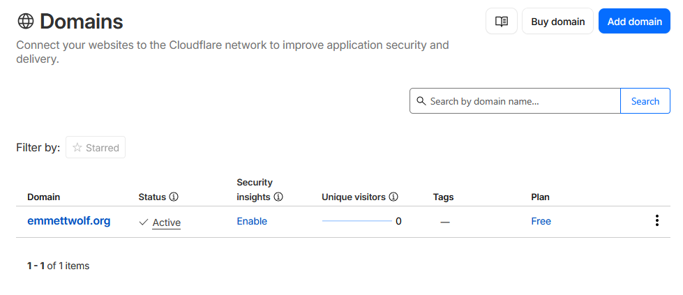
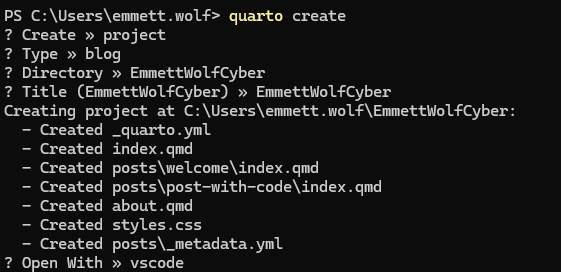
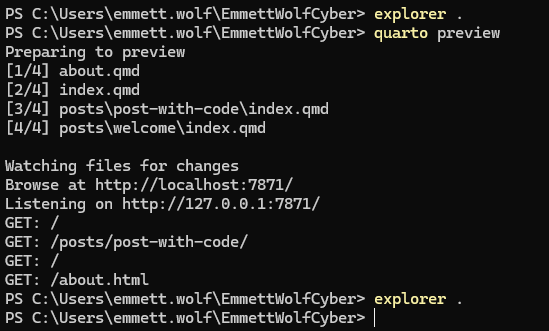
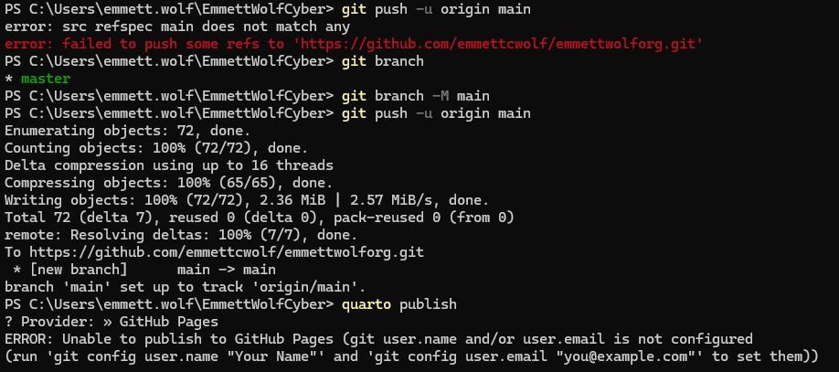
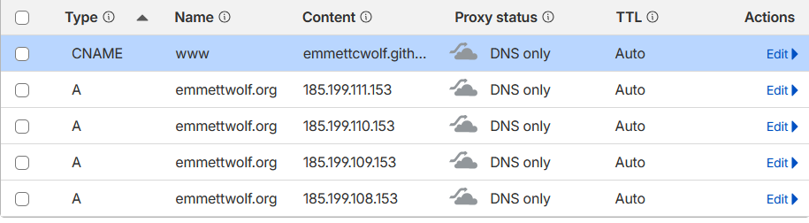

## Introduction
It seems fitting to start this portfolio with the construction of the portfolio itself. My coding experience is almost entirely in Python, so there is nothing more terrifying than GitHub (or the terminal). It seems like the barrier to entry of these two essential skills is steep, but I knew I would need to learn it *at some point.* So, I have been trying to expose myself to it with some smaller projects over the past few weeks.

The Quarto module made this project so much easier. Without it, it would have taken me much more time and exhausting effort to figure it out. However, there were still plenty of hurdles that I had to figure out just to get the website functioning.

### First, the easy stuff

No one is going to make it hard for you to give them money. So, getting the Cloudflare domain was simple. 5 minutes and a small hit on the bank account got me the domain for the next year. Easy stuff.

### Quarto Initiation

Now, the slightly scary stuff. I always fear opening the terminal, but it has been getting easier. Working with a module like Quarto definitely helped me overcome my fears. A few menus and quick responses made the process super easy. Within minutes, I had a local directory opened with all the required files to get it running. A quick "quarto preview" gave me a small boost to push through the rest. I think it knew I'd need it...

### GitHub Chaos

Going through the whole git init, git add ., git commit, git push flow was not something new for me. I'd forced myself to do it multiple times with a few VSCode files just to get in the hang of it. What I did *not* anticipate was the mess I was already building for myself. I had planned to use the quarto_actions addition to automate updates to the blog. However, I am still in the novice level when it comes to understanding GitHub's branches. I put them all into main and went about the rest of the project.

After shedding a single tear at the sight of my mistake, I spent the next hour troubleshooting how to get this folder out of main and into the gh-pages branch (which I also admittedly had to create).

I still don't quite understand how this works, but I figure with more time under the hood of GitHub, I'll get the basic idea. Still, this took a lot of troubleshooting and random terminal command guesses to get functioning.

As a cherry on top, I went through a dark learning phase of connecting GitHub to my Cloudflare DNS. After plenty of trial and error (and the realization that the proxy status had to be set to DNS only), I was able to get past the DNS error in the GitHub settings.

### Final Notes

So, it seemed like my website was somewhat up and running. I spent a bit more time making a few cosmetic changes and tinkering with the file structure, but I think it's a decent start. I am starting to face my GitHub and terminal fears, with many lessons in each encounter. I'd place my odds at 50/50 between having terminal commands function or producing massive errors which lead me down to rabit holes requiring my attention for hours. Still, the process was relatively simple and I feel much more confident in my terminal abilities.

If I can take anything away from this, at least I know how to open the cwd from terminal now (explorer .)